# Instruction for DJI Thermal Palette Transformation

Developer: Dr. `Haitao Lyu` (`hxl170008@utdallas.edu`) 

- GitHub: [https://github.com/lyuhaitao](https://github.com/lyuhaitao) 

- LinkedIN: [https://www.linkedin.com/in/lyuhaitao](https://www.linkedin.com/in/lyuhaitao/) 

## Overview

Currently, I mainly focus on the research about Small Object Detection From Low-Resolution Thermal Image. My research has been used to do wild deer survey in the Chitwan National Park of Nepal. The park is yearly covered by tall vegetation and trees so that wild deer are often hidden under dense canopies, which is difficult for using popular high-resolution RGB images to detect them as shown in the following.

| 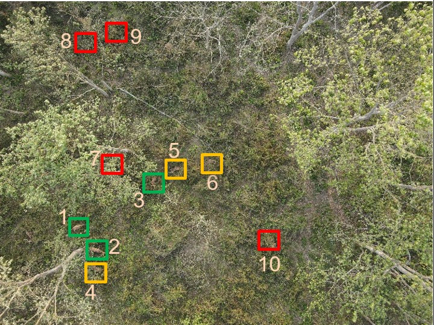 | 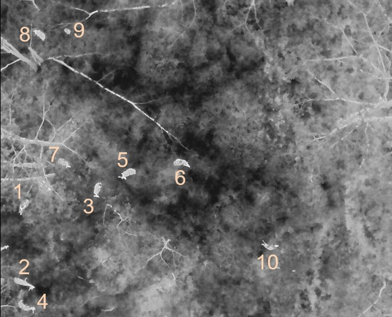 |
| -------------------------------------------------------- | -------------------------------------------------------- |

The left figure displays a true-color image with a resolution of 8000 x 6000 pixels, where 3 deer are easily visible in an open space near a tree (marked by green rectangles), 3 deer are partially visible between tree canopies (yellow rectangles), and four deer are obscured by tree canopies (red rectangles) and not visible. The right figure showcases a thermal image with a resolution of 640 x 512 pixels, where all 10 deer are visible, including those under tree canopies, due to their body temperatures being higher than the ambient background.

When doing wild deer surveys, several field research teams  usually simultaneously use drones to capture wild animals in different research areas. These teams may have different preferences for thermal image color palettes, resulting in a dataset with inconsistent color schemes. This will have negative effects on using them to train an object detection model based on deep learning.

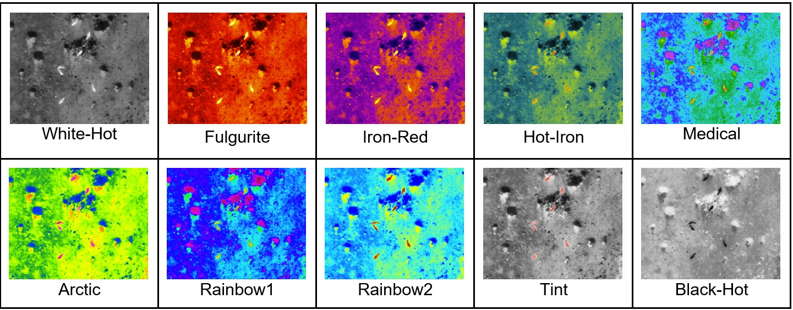

To address this issue, I utilize <mark>PyQT6</mark> to develop a GUI application, which can be used to transform and uniform the color palette of thermal images captured by DJI drones. In addition, the details about using the object detection model `Faster R-CNN` to detect wild deer from thermal images are introduced in the paper [Deer survey from drone thermal imagery using enhanced faster R-CNN based on ResNets and FPN](https://doi.org/10.1016/j.ecoinf.2023.102383) . 

## Download Application

Click [Download Thermal Palette Transform](https://utdallas.box.com/s/mbb1idjwbtz74o091pev7wn3fb8yhp8y) to download the application.

Download URL: <div><a href='https://utdallas.box.com/s/mbb1idjwbtz74o091pev7wn3fb8yhp8y'>https://utdallas.box.com/s/mbb1idjwbtz74o091pev7wn3fb8yhp8y</a> </div>

It includes a zip file and a folder.

- TPT.zip 

- buffalo. It is a folder that stores the testing thermal images captured by DJI drones.

## Unzip TPT.zip

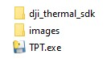

## Getting Started

- Launching the Software: Double click `TPT.exe`

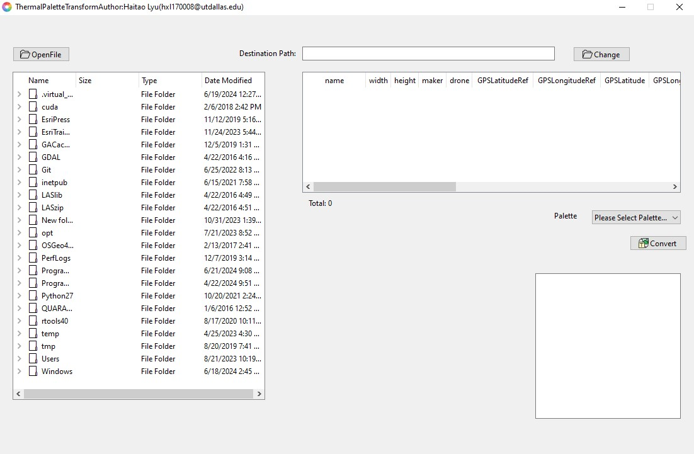

- Click the `OpenFile` button or Use shortkey `Ctrl+o` to open `Folder Selection Dialogue`.

- Navigate to the folder storing the thermal images captured by DJI drones.

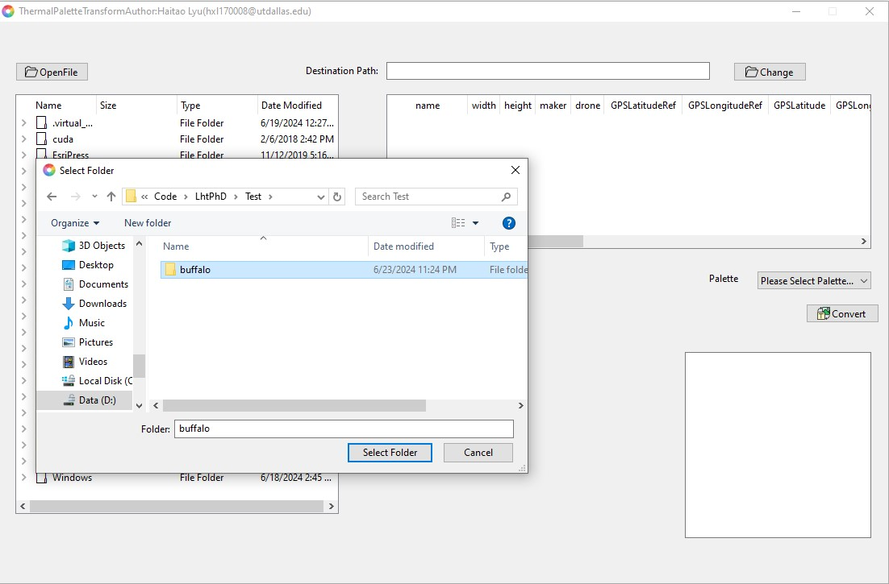

- Click `Select Folder` 

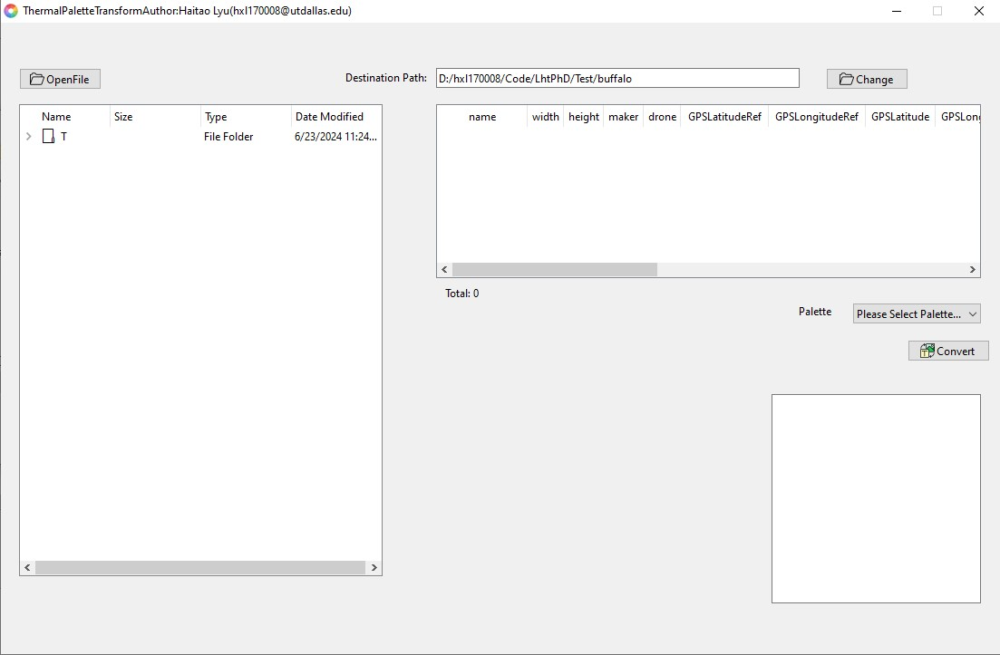

- Double click any image icon, and the detailed information extracted from its meta data is shown in the table on the right. 
  
  The columns include `name, width, height, maker, dronetype, GPSLatitudeRef, GPSLongitudeRef, GPSLatitude, GPSLongitude, GPSAltitude`

`GPSRelativeAltitude, GimbalDegree, FlightDegree, datetime`.

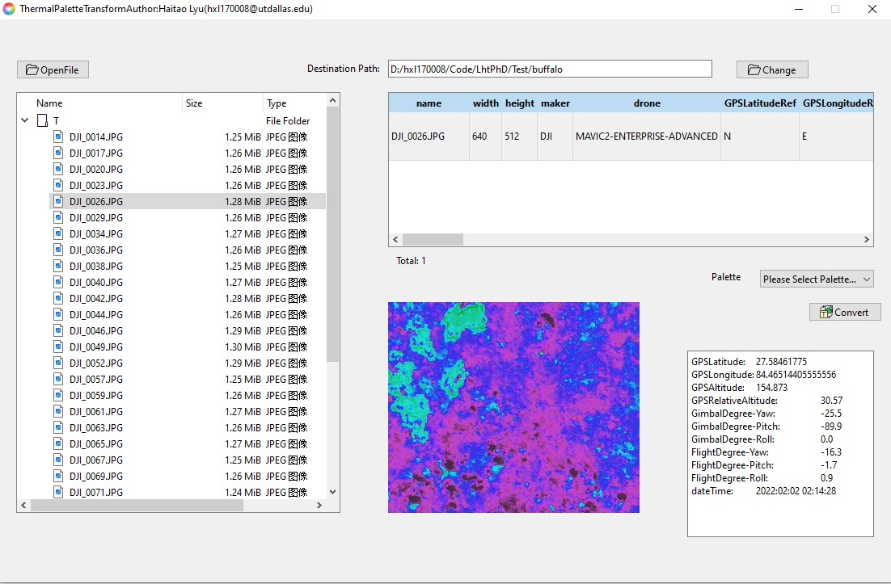

- if the folder `T` is double clicked, the detailed information records  of the image in this folder will be listed in the right table.

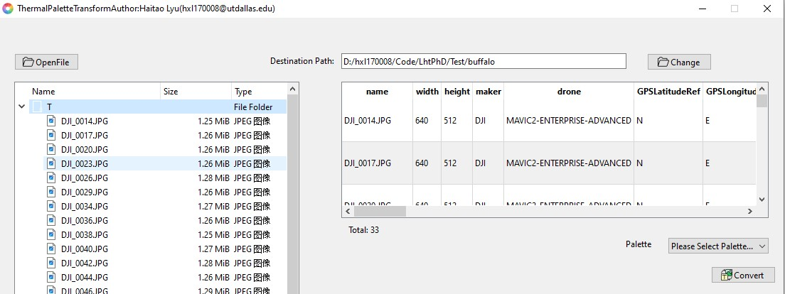

- Single click the row in the talbe on the right, and the detailed information is listed below.

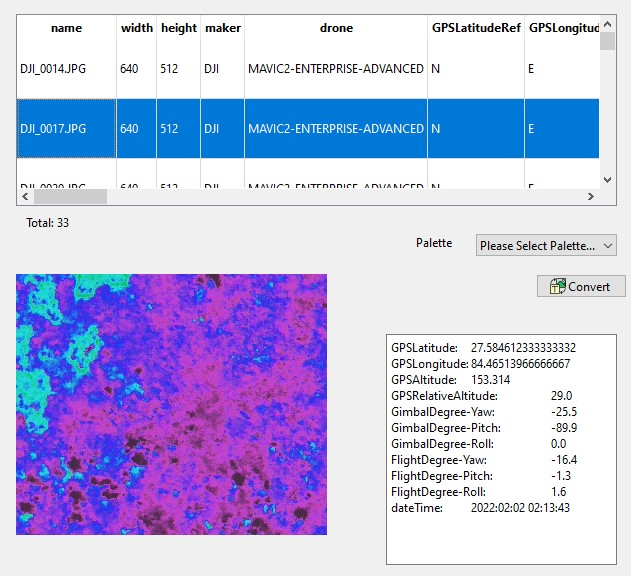

- From the dropdown list of Palette, different palettes can be chosen.

| 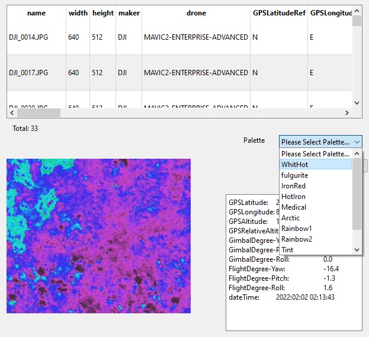 | 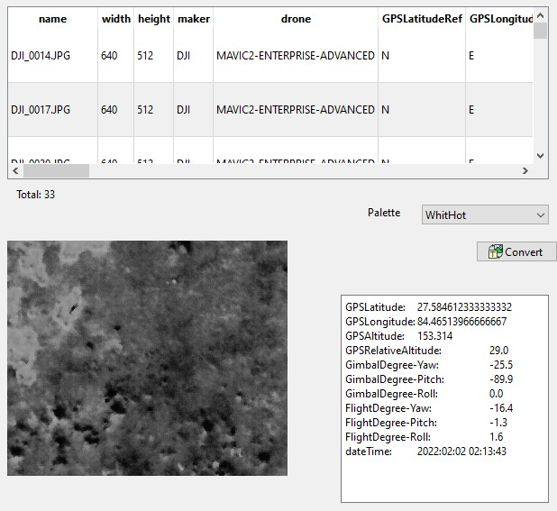 |
| -------------------------------------------------------- | -------------------------------------------------------- |

- Click `Convert` button. The program will automatically create a new folder in the destination folder. The folder name is based on the thermal palette ID.

`0: WhiteHot; 1: Fulgurite; 2: IronRed; 3: HotIron; 4: Medical; 5: Arctic; 6: Rainbow1, 7: Rainbow2, 8: Tint, 9: BlackHot, 10: Heatmap` 

For example, as shown in the following figure, the color palettes of the thermal images listed in the table are standardized to be `IronRed`. Based on the `ID` of `IronRed`, a new 

folder named `2` is created to store the thermal images with the same palette: `IronRed`.

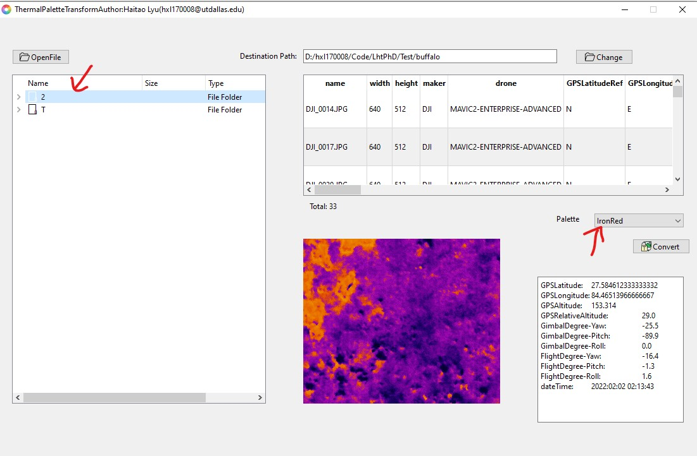

## Heatmap

Because the pixel value in a heatmap represents the temperature when it was captured by DJI drones, which is complelely different from the pixel value in RGB or thermal images. Therefore, when `Heatmap` in the `Palette` dropdown list is chosen, all thermal images will be transformed to binary files with the file extention `.npy`.

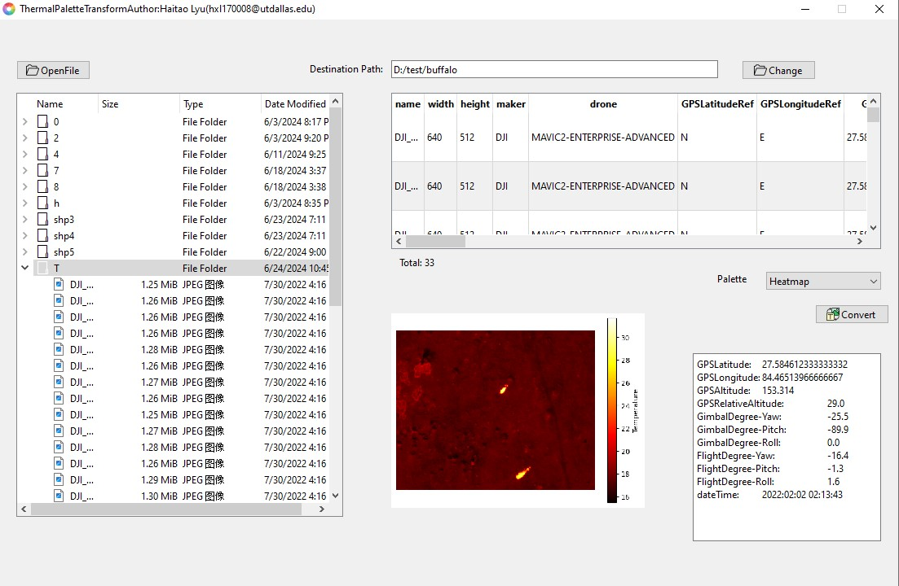

If you would like to show a heatmap in your program, please refer to the following code.

```python
import numpy as np
import matplotlib.pyplot as plt


heatmap_file_path = r"D:\test\DJI_0020.npy"
img = np.load(heatmap_file_path)
fig, ax = plt.subplots()
im = ax.imshow(img,cmap='hot')
fig.colorbar(im,label='Temperature', ax=ax)
ax.set_axis_off()
plt.show()
```
